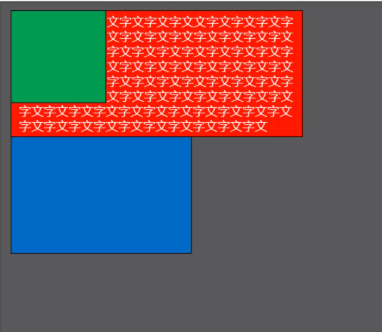
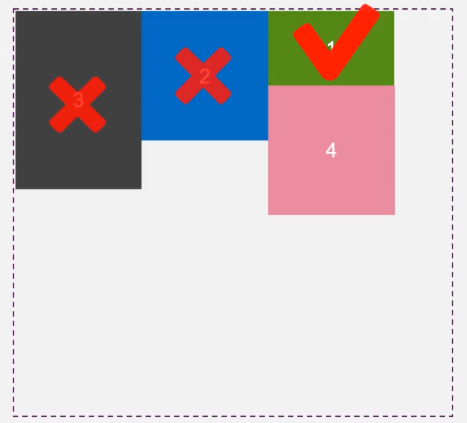
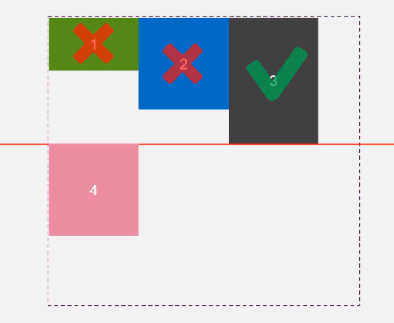

# CSS3

## 资源站点

- [CSS88](http://css88.com/book/css)

## CSS2 选择器

- 通配符选择器
- 元素选择器
- 类选择器
- ID 选择器
- 后代选择器
- 群组选择器(IE6+)

## CSS3 新增选择器

- 子元素选择器
  - 语法：parent > children
  - 兼容性：IE8+, Firefox, Chrome, Safari, Opera
- 相邻兄弟元素选择器
  - 语法：element + siblingElement
  - 兼容性：IE8+, Firefox, Chrome, Safari, Opera
- 通用兄弟选择器
  - 语法：element ~ siblingElement
  - 兼容性：IE8+, Firefox, Chrome, Safari, Opera

## [CSS3 属性选择器](./selector/attribute_selector.html)

- `E[attr]` 有 attr **属性**
- `E[attr="value"]` 属性值 **相等**
- `E[attr^="value"` value **开头属性值**
- `E[attr$="value"]` value **结尾属性值**
- `E[attr*="value"]` 属性中包含了 value **包含**
- `E[attr|="value"]` 属性中包含了 value 或者 **value-开头的值**（比如：zh-cn）
- `E[attr~="value"]` 属性值是一个词列表，并且以**空格隔开**，其中次列表中包含了一个 value 词，而且等号前面的“~”不能大写

## 动态伪类

> 用户和网站交互的时候提现出来

### 锚点伪类

- :link
- :visited

### 用户行为伪类

- :hover
- :active
- :focus

## UI 元素状态伪类

- :enabled
- :disabled
- :checked(仅 Opera 支持)
- 兼容性：IE9+, FireFox, Chrome, Safari, Opera

## [CSS3 结构伪类选择器](./selector/structure_selector.html)

- E:nth-child(n)：E 父元素中的第 n 个字节点 (IE9+, Firefox4+)
  - p:nth-child(odd) {} 匹配奇数行
  - p:nth-child(even) {} 匹配偶数行
  - p:nth-child(2n) {} 偶数行
  - p:nth-child(2n-1) {} 奇数行
- E:nth-last-child(n) 表示 E 父元素中的第 n 个字节点，从后向前计算
- E:nth-of-type(n) 表示 E 父元素中的第 n 个字节点，且类型为 E
  - IE9+, Firefox4+
- E:nth-last-of-type(n) 表示 E 父元素中的第 n 个字节点，且类型为 E，从后向前计算
- E:empty() 表示 E 元素中没有子节点，注意：子节点包括文本节点
- E:first-child == E:nth-child(1) E 元素的父元素的**首个子元素**的**每个 element 元素**
  - IE9+
- :last-child == :nth-last-child(1)
- E:first-of-type == E:nth-of-type(1) E 元素的父元素的**E 类型首个子元素**的**每个 element 元素**
- :last-of-type == nth-last-of-type(1)

- E:first-child 表示 E 元素中的第一个子节点
- E:last-child 表示 E 元素中的最后一个子节点
- E:first-of-type 表示 E 元素中的第一个子节点且节点类型是 E 的
- E:last-of-type 表示 E 元素中最后一个子节点且节点类型是 E 的
- E:only-child 表示 E 元素中只有一个子节点，注意：自己诶但不包含文本节点
- E:only-of-type 表示 E 父元素中只有一个子节点，且这个唯一的子节点的类型必须是 E。注意：子节点不包括文本节点

## [伪类选择器](./selector/weilei_selector.html)

- E:target 表示当前的 URL 片段的元素类型，这个元素必须是 E
  - 被锚链接指向的时候会触发该选择器
- E:disabled 不可点击的表单控件
- E:enabled 可点击的表单控件
- E:checked 已选中的 checkbox 或 radio

- E::first-line E 块元素中的第一行
- E::first-letter
- E::selection 表示 E 元素在用户选中文字时
  - 鼠标被选中的时候触发
- E::before 生成内容在 E 元素之前
  - .c1:before{content:'\*',color:red}
- E::after

- E:not(子元素/子选择器) 表示 E 元素不被匹配
- E~F 表示 E 元素挨着的 F 元素
- Content 属性

- 脱离文档流

  - float
  - absolute
  - fixed

- rgba() 只改变背景颜色的透明度效果（opacity 改变元素和其子元素的透明效果）
- 文字阴影：text-shadow: 2px 2px 4px black;
- 阴影叠加：text-shadow: 2px 2px 0px red, 2px 2px 4px green;
- 层叠：color:red;font-size:100px;font-weight:bold;text-shadow:2px 2px 0px white,4px 4px 0px red;
- 光晕：color:white;font-size:100px;text-shadow:0 0 10px #fff,0 0 20px #fff,0 0 30px #fff, 0 0 40px #ff00de, 0 0 70px #ff00de, 0 0 80px #ff00de, 0 0 100px #ff00de, 0 0 150px #ff00de;
- 文字描边：-webkit-text-stroke: 宽度 颜色;
- 文字排列：direction: rtl | ltr; rtl: 从右向左排列; ltr: 从左向右排列
  - 注意要配合 unicode-bidi 一块使用
- text-overflow: clip | ellipsis;
  - ellipsis 省略号 注意配合`text-overflow:ellipsis;overlfow:hidden;white-space:nowrap;` 一块使用

## 自定义文字

```css
@font-face {
  font-faimily: "wovert";
  src: url("../font/wovert-webfont.eot");
  src: url(../font/wovert-webfont.eot?#iefix) format("embedded-opentype"), url("../font/wovert-webfont.woff")
      format("woff"), url("../font/wovert-webfont.tty") format("truetype"), url("../font/wovert-webfont.svg#untitledregular")
      format("svg");
  font-weight: normal;
  font-style: normal;
}

body {
  font-family: "Helvetica Neue", Helvetica, Microsoft Yahei, Hiragino Sans GB,
    WenQuanYi Micro Hei, sans-serif;
}
[class^="icon-"],
[class*=" icon-"] {
  font-family: wovert;
}
```

- [转换字体格式生成兼容代码](http://fontsquirrel.com/fontface/generator)

## 新盒子模型

> width 和 height 包括哪些

- box-sizing: content-box(默认) | border-box | padding-box
  - border-box: 整个盒子的宽高

## CSS 其他属性

- perspective: 视距，实现 3D 动画必用的属性
- @media: 媒体查询，实现响应式布局
- @font-face: 导入字体图标

- T1.1~1.3 p1~p3 初级工程师
- T2.1~2.3 p4~p6 高级工程师(25K)
- T3.1~3.3 p7~p9 架构师

## 弹性盒模型

- 弹性盒模型父元素必须要加 display:box 或 display:inline-box
- box-orient 定义盒模型的布局方向
  - horizontal 水平显示
  - vertical 垂直方向
- box-direction 元素排列顺序
  - normal 正序
  - reverse 反序
- box-ordinal-group 设置元素的具体位置

## Bootstrap

### Compatible

> 文旦兼容模式，表示如果在 IE 浏览器下则使用最新的标准渲染当前文档

```HTML
<meta http-equiv="X-UA-Compatible" content="IE=edge">
```

### 视口

```HTML
<meta name="viewport" content="width=device-width,initial-scale=1">
```

- 适口的作用：在移动浏览器中，当页面宽度超出设备，浏览器内部虚拟的一个页面，将页面容器缩放到设备这个大，然后展示
- 目前大多数收集浏览器的视口（承载页面的容器）宽度都是 980
- 视口的宽度可以通过 meta 标签设置
- 此属性为移动端页面适口设置，当前值标识在移动端页面的宽度为设备的宽度，并缩放（缩放级别为 1）
  - width: 视口的宽度
  - initial-scale：初始化缩放
  - user-scalable: 是否允许用户自行缩放（value:{yes|no},{1|0}）
  - minimun-scale: 最小缩放
  - maxmun-scale: 最大缩放

## 老师浏览器支持 HTML5

```HTML
<!--[if IE]>
<script src="http://html5shiv.googlecode.com/svn/trunk/html5.js"></script>
<![endif]-->
<style>
  width: 50px;
  height: 50px;
  background: rgb(167, 255 ,109);
  -moz-border-radius: 15px; /* Firefox */
  -webkit-border-radius: 15px; /* Safari and Chrome*/
  border-radius: 15px; /* Opera 10.5+, future browsers, and now also Internet Explorer 6+ using IE-CSS3  */
  -moz-box-shadow: 10px 10p 20px #000; /* Firefox */
  -webkit-box-shadow: 10px 10px 20px #000; /* Sfari and Chrome */
  box-shadow: 10px 10px 20px #000; /* Opera 10.5+, future browsers and IE6+ using IE-CSS# */
  behavior: url(ie-css3.htc); /* IE6模仿大部分CSS3  */
  /*
    IE中的 CSS3不完全兼容方案
    www.cnblogs.com/platero/archive/2010/08/31/1870151.html
  */

</style>
```

### 实例

[Flex 布局](./flexbox-playground/index.html)

[瀑布流](./pubu-fenlan/picEnd.html)

[文本分栏](./pubu-fenlan/textEnd.html)

[媒体查询](./MediaQuery/textEnd.html)

[响应式表格](./responsive-table/end.html)

[响应式图片](./responsive-pic/end.html)

## float

> 任何元素浮动之后都会变成块元素
> 浮动元素脱离网页文档，与其他元素发生重叠。但是，不会与文字内容发生重叠



浮动元素在排列时，只参考前一个元素位置即可





- 浮动元素的重叠问题
  - 浮动元素不会覆盖文字内容
  - 浮动元素不会覆盖图片内容（因为图片本身也属于文本）
  - 浮动元素不会覆盖表单元素（输入框、单选按钮、复选框、按钮、下拉选择框等）

## clear 清除浮动(清除的是浮动带来的负面效果 -> 父标签塌陷(撑不起来))

最常和伪元素结合起来应用

```shell
.clearfix:after {
  content: "";
  display: block;
  clear: both
}
```

## font-family

```CSS
font-family: "Microsoft Yahei", "微软雅黑", "Arial", sans-serif;
```

## background

### background-clip

> 背景图像区域：background-clip

- border-box 背景被裁剪到边框盒
- padding-box 背景被裁剪到内边距框 default
- content-box 背景被裁剪到内容框
- 兼容性：IE9+, FireFox, Chrome, Safari, Opera

### background-origin

> 背景图像定位， backgrouind-origin 属性指定 background-position 属性应该是相对位置

- 设置元素背景图片(background-position)的原始起始位置(默认是 0，0)
- padding-box 背景图像相对内边距定位(padding 左上角) default
- border-box 背景图像相对边框定位(边框左上角)
- content-box 背景图像相对内容区域定位(内容区域左上角)
- 兼容性：IE9+, FireFox4+, Chrome, Safari5+, Opera

### background-size

> 背景图像大小

- length | percent | cover | contain
  - 100% auto; 高自适应
  - 100% 100%; 拉伸效果
  - 50% auto; 宽度 50% 高自适应
  - 600px auto;
  - cover: 不留白，等比例最大化显示
    - 高度正好，宽度会溢出
  - contain: 宽 100%(高留白) 或 高 100%(宽留白)
- 兼容性：IE9+, FireFox4+, Chrome, Safari5+, Opera

### background-image: url(), url(), ...

> 多重背景图像，允许为元素使用多个背景图像

- background-image: url(1.png), url(2.jpg)
  - 1.png 上一层图片一次覆盖后面的图
  - 2.jpg 下一层显示

### 背景属性整合

- `background: color position size repeat origin clip attachment image;`
- background: #abcdef center no-repeat content-box content-box fixed url(1.jpg)

## grandients

> 在两个或多个指定的颜色之间显示平稳的过度

- 兼容性：
  - IE10+
  - Chrome 26+, 10.0 -webkit-
  - Firefox 16+, 3.6 -moz-
  - Safari 6.1+, 5.1 -webkit-
  - Opera 12.1+, 11.6 -o-

### linear Gradients 线性渐变属性

> 是沿着一根轴线改变颜色，从起点到终点颜色进行顺序渐变（从一边拉向另一边）

- `background: linear-grandient(direction方向, color-stop1, color-stop2, ..)`

```CSS
background: -webkit-linear-grandient(red, blue);
background: -moz-linear-gradient(red, blue);
background: -o-linear-gradient(red, blue);
background: linear-gradient(red,blue);

从上到下, 红色到蓝色(默认)
background: linear-grandient(color-stop1, color-stop2, ...)


从左到右
background: -webkit-linear-grandient(begin-direction, red, blue);
background: -moz-linear-gradient(end-direction, red, blue);
background: -o-linear-gradient(end-directon, red, blue);
background: linear-gradient(to end-direction, red,blue);

background: -webkit-linear-grandient(left, red, blue);
background: -moz-linear-gradient(right, red, blue);
background: -o-linear-gradient(right, red, blue);
background: linear-gradient(to right, red,blue);

对角(从左上角对右下角)
background: -webkit-linear-grandient(begin-level begin-vertical, red, blue);
background: -moz-linear-gradient(end-level end-vertical, red, blue);
background: -o-linear-gradient(end-level end-vertical, red, blue);
background: linear-gradient(to end-level end-vertical, red,blue);


background: -webkit-linear-grandient(let top, red, blue);
background: -moz-linear-gradient(right bottom, red, blue);
background: -o-linear-gradient(right bottom, red, blue);
background: linear-gradient(to right bottom, red,blue);


使用角度
background: linear-gradient(angle color-stop1, color-stop2, ...)


角度是指水平线和渐变线之间的角度，逆时针方向计算。
上到右(0deg - 90deg)
0deg 将创建一个从下到上的渐变
90deg 将创建一个从左到右的渐变


background: -webkit-linear-grandient(90deg, red 10%, orange 15%, yellow 20%, green 50%, blue 70%, indigo 80%, violet 100%);
background: -moz-linear-gradient(90deg, red 10%, orange 15%, yellow 20%, green 50%, blue 70%, indigo 80%, violet 100%);
background: -o-linear-gradient(90deg, red 10%, orange 15%, yellow 20%, green 50%, blue 70%, indigo 80%, violet 100%);
background: linear-gradient(90deg, red 10%, orange 15%, yellow 20%, green 50%, blue 70%, indigo 80%, violet 100%);

透明渐变
background: -webkit-linear-grandient(90deg, rgba(255,0,0,0), rgba(255,0,0,1));
background: -moz-linear-gradient(90deg, rgba(255,0,0,0), rgba(255,0,0,1));
background: -o-linear-gradient(90deg, rgba(255,0,0,0), rgba(255,0,0,1));
background: linear-gradient(90deg, rgba(255,0,0,0), rgba(255,0,0,1));


```

线性渐变-重复渐变

```CSS
background: repeating-linear-gradient: color1 length | percentage, color2 length | percentage, ...);


渐变会重复5边
background: -webkit-repeating-linear-grandient(90deg, red 0%, blue 20%);
background: -moz-repeating-linear-gradient(90deg, red 0%, blue 20%);
background: -o-repeating-linear-gradient(90deg, red 0%, blue 20%);
background: linear-repeating-gradient(90deg, red 0%, blue 20%);
```

### 径向渐变

> 从起点到终点颜色从内到外进行圆形渐变（从中间向外拉）

`background: radial-grandient(center, shape size, start-color1, ..., last-color)`

```CSS
background: -webkit-radial-gradient(red, blue);
background: -moz-radial-gradient(red, blue);
background: -o-radial-gradient(red, blue);
background: radial-gradient(red, blue);

颜色结点均匀分布（默认）
background: radial-gradient(color-stop1, color-stop2, ...);

颜色节点不均匀分布
background: radial-gradient(color1 length | percentage, color2 length | percentage, ...);

半径的50%，半径的70%
background: -webkit-radial-gradient(red 50%, blue 70%);
background: -moz-radial-gradient(red 50%, blue 70%);
background: -o-radial-gradient(red 50%, blue 70%);
background: radial-gradient(red 50%, blue 70%);

径向渐变-设置形状
background: radial-gradient(shape, color-stop1, color-stop2, ...);
circle - 圆形
ellipse - 椭圆(默认)

background: -webkit-radial-gradient(circle, red, blue);
background: -moz-radial-gradient(circle, red, blue);
background: -o-radial-gradient(circle, red, blue);
background: radial-gradient(circle, red, blue);

尺寸大小关键字
backgroun: radial-gradient(size, color-stop1, color-stop2, ...);
closest-side： 最近边
closest-corner: 最近角
farthest-side: 最远边
farthest-corner: 最远角

30% 70% 是圆心位置
background: -webkit-radial-gradient(30% 70%, closest-side circle, red, blue);
background: -moz-radial-gradient(30% 70%, closest-side circle, red, blue);
background: -o-radial-gradient(30% 70%, closest-side circle, red, blue);
background: radial-gradient(30% 70%, closest-side circle, red, blue);

background: -webkit-radial-gradient(30% 70%, closest-corner circle, red, blue);
background: -moz-radial-gradient(30% 70%, closest-corner circle, red, blue);
background: -o-radial-gradient(30% 70%, closest-corner circle, red, blue);
background: radial-gradient(30% 70%, closest-corner circle, red, blue);

background: -webkit-radial-gradient(30% 70%, farthest-side circle, red, blue);
background: -moz-radial-gradient(30% 70%, farthest-side circle, red, blue);
background: -o-radial-gradient(30% 70%, farthest-side circle, red, blue);
background: radial-gradient(30% 70%, farthest-side circle, red, blue);

background: -webkit-radial-gradient(30% 70%, farthest-corner circle, red, blue);
background: -moz-radial-gradient(30% 70%, farthest-corner circle, red, blue);
background: -o-radial-gradient(30% 70%, farthest-corner circle, red, blue);
background: radial-gradient(30% 70%, farthest-corner circle, red, blue);

重复渐变
background: repeating-radial-gradicent(color1 length | percentage, color2 length | percentage, ...);

background: -webkit-repeating-radial-grandient(red 0%, blue 10%, red 20%);
background: -moz-repeating-radial-gradient(red 0%, blue 10%, red 20%);
background: -o-repeating-radial-gradient(red 0%, blue 10%, red 20%);
background: radial-repeating-gradient(red 0%, blue 10%, red 20%);
```

IE6-8 渐变

```CSS
filter: progid: DXImageTransform.Miscrosoft.gradient(startColorstr='#startColor', endColorstr='#endColor', GradientType=0);

GradientType = 0 上红下黑
GradientType = 1 左红右黑
GradientType = 2 上蓝下黑

filter: progid: DXImageTransform.Miscrosoft.gradient(startColorstr='#ff0000', endColorstr='#0000ff', GradientType=0);
```

## 圆角

> border-radius 属性最多可指定四个 border-\*-radius 属性的复合属性

- border-radius: 1-4 length | % / 1-4 length | %;
- 兼容性：IE9+, Firefox4+, Chrome, Safari5+, Opera
- 多值：左上角,右上角,右下角,左下角
- border-top-left-raidus: 左上角
- border-top-right-radius: 右上角
- border-bottom-right-radius: 有下角
- border-bottom-left-radius: 左下角

## 盒阴影

> 设置一个或多个下拉阴影的框

- `box-shadow: h-shadow v-shadow blur spread扩展 color inset;`
- blur 不可以有负值
- spread 向四个方向扩张
- insert 内阴影，可以网内扩张，即负值
- 兼容性：IE9+， FireFox4+, Chrome, Safari5+, Opera

## 边界图片 - border-image 属性

> border-image-\* 属性来构建可扩展按钮

- `border-image: source slice width outset repeat;`
- 兼容性：IE 和 Opera 不兼容, Chrome, FireFox, Safari6+

- border-image-source: none | image;
- border-image-slice: number|%|fill; 指定图像的边界向内偏移
- border-image-width 属性指定图像边界的宽度

- border-image-width: number | % | auto;
- border-image-outset: length | number; 往元素外边扩张
- border-image-repeat: repeated | stretched(默认，拉伸) | rounded(铺满) | initial | inherit;


```css
/* 设置边框图片 */
border-image-source: url("2.png");

/* 边框图片裁切 : 不需要带单位*/
border-image-slice: 20;

/* 设置边框图片的平铺方式 */
/* border-image-repeat: stretch; */
border-image-repeat: round;
/*  border-image-repeat: repeat; */

border-image-width: 20px;
```

## 过度 - transition

- `transition: 过度时间 过度样式 过度形式 延迟时间;`
- `transition: 1s width, 2s height, 3s background`

- 过渡时间：

  - s: 秒
  - ms: 毫秒

- 过度样式：

  - all: 所有样式
  - width: 宽度过度样式

- 过度形式：

  - ease: 逐渐变慢 默认值
  - linear: 匀速
  - ease-in： 加速
  - ease-out: 减速
  - ease-in-out: 先加速后慢速
  - [cubic-bezier](http://matthewlein.com/ceaser/): 贝塞尔曲线(x1,y1,x2,y2)

- 延迟时间：等待多长时间开始过度动画

### transitionend 事件

- [transitionend 事件](./transition/index_js.html)
- 问题：[重复执行过度](./transition/index_js_repeat.html)


## 过度-transition

> 允许 CSS 属性在一定时间区间内平滑的过度；在鼠标单击、获得焦点、被点击或对元素任何改变中触发，并圆滑的以动画效果改变 CSS 的属性值

- 一个元素从一种表现形态转换为另一种变现形态。
- CSS 值发生变化。
- 效率高，瞬间变化，速度快
- 前 1S 的视觉在人眼中停留 0.1s；CSS 变化时间 < 0.1s, 20 帧/s

- 兼容性：IE10+, FF16+, Chrome26+, Safari6.1+, Opera12.1+

1. 打开扩展程序输入 `autoprefixer` 查找插件安装
2. 安装好后打开 cmd 窗口运行：`npm i -g autoprefixer`，但在此之前要先保证电脑中安装了 node
3. 在菜单里设置：文件---首选项--键盘快捷方式----搜索框下面有一句灰色的话：高级自定义请打开编辑 keybingings.json，点击 keybindings.json，在右边的[ ]里添加：:

```conf
{
  "key": "ctrl+shift+c",
  "command": "autoprefixer.execute"
}
```

4. 然后在 css 写了样式保存后，按 ctrl+shift+c 就可以格式化了。当然，是一键格式当前文件所有，不用每次都格式化。如果报错说 command 'autoprefixer.execute' not found，就把插件 autoprefixer 重新安装一下

注意：搜狗五笔输入法中 ctrl+shift+c 这个快捷键冲突了，要更改一下搜狗里快捷键的设置

### transition 过度属性

- transition-property

  - 检索或设置对象中的参与过度的属性
  - `transition-property: none | all | property;`
    - none 没有属性改变
    - all 所有属性改变，默认值
    - property 元素的属性名称 （color, opacity...)

- transition-duration 属性

  - 检索或设置对象过度的持续时间
  - transition-duration: time;
  - 规定完成过度效果需要花费的时间（以秒或毫秒计）
  - 默认值是 0
  - 慢-快-慢
  - 快-慢
  - 慢-快
  - 匀速

- transition-timing-function 属性

  - 检索或设置对象中过度的动画类型
  - ease：平滑过渡。等同于贝塞尔曲线（0.25, 0.1, 0.25, 1.0）
  - linear: 现行过度。等同于贝塞尔曲线（0.0, 0.0, 1.0, 1.0）
    - 开始多快，结束多快
  - ease-in: 由慢到块。等同于贝塞尔曲线（0.42, 0, 1.0, 1.0）
    - ease 和 ease-in 结束比较生硬
  - ease-out：由快到慢。等同于贝塞尔曲线（0, 0, 0.58, 1.0）
  - ease-in-out：由慢到快再到慢。等同于贝塞尔曲线（0.42, 0, 0.58, 1.0）
  - step-start：等同于 steps(1, start)
  - step-end：等同于 steps(1, end)
  - steps(<integer>[, [start | end]]？): 接受两个参数的步进函数
    - 第一个参数：必须为正整数，指定函数
    - 第二个参数：取值可是 start 或 end，指定每一步的值发生变化的时间点
  - cubic-bezier(<number>,<number>,<number>,<number>)

- transition-delay 属性

  - 检索或设置对象延迟过度的时间
  - 是即可执行还是延迟执行
  - `transition-delay: time;`
    - 指定秒或毫秒数之前要等待切换效果开始
    - 默认值为 0

- transition 复合水泥股，检索或设置对象变换时的过度
- `transition: property duration timing-function delay`

## transform 转换

> 让元素在一个坐标系统中变形。这个属性包含一系列变形函数，可以移动、旋转和缩放元素。

`transform: none | <transform-function> [ <transform-function> ]*`

- 默认值：`transform: none`

- 兼容性：IE12+, FF16+, Chrome36+, Safari16+, Opera23+

### CSS3 Transform

- CSS3 rotate()
  - 通过指定的角度参数对原元素指定一个 2D rotation(2D 旋转)
  - `transform: rotate(<angle>)`
  - angle 指旋转角度，正数表示顺时针旋转，负数表示逆时针旋转
- CSS3 translate()
  - 根据左(X 轴)和顶部(Y 轴)位置给定的参数，从当前元素位置移动
  - `transform: translateX(x)` 仅水平方向移动(X 轴一定)
  - `transform: translateY(y)` 仅垂直方向移动(Y 轴一定)
  - `transform: translate(x,y)` 水平方向和垂直方向同时移动（也就是 X 轴和 Y 轴同时移动）
  - 左上角是原点
- CSS3 scale()
  - `transform: scaleX(x)` 元素仅水平方向缩放（X 轴缩放）
  - `transform: scaleY(y)` 元素仅垂直方向缩放（Y 轴缩放）
  - `transofmr: scale(x,y)` 使元素水平方向和垂直方向同时缩放（也就是 X 轴和 Y 轴同时缩放）
- CSS3 skew()
  - `transform: skewX(<angle>)` 按指定的角度沿 X 轴指定一个 skew transformation(斜切变换) 正值：逆时针
  - `transform: skewY(<angle>)` 正值：顺时针，负值：逆时针
  - 轴心是中心点
  - `transform: skew(<anble>[, <anble>])`
- CSS3 matrix()
  - 以一个含六值的(a,b,c,d,e,f) 变换矩阵的形式指定一个 2D 变换
  - 相当于直接应用一个[a,b,c,d,e,f] 变换矩阵
  - transform: matrix(a,c,b,d,tx,ty) tx,ty 就是基于 X 和 Y 坐标重新定位元素

### CSS3 2D 转换

- `translate(<translation-value>[, <translation-value>])`
  - 通过矢量[tx,txy] 指定一个 2D translation, tx 是第一个过渡值参数，ty 是第二个过渡值参数选项
  - `transform: translate(<translate-value> [, <translation-value>])`

### CSS3 3D 转换


- `transform: rotate3d()`
  - `transform: rotateX()`
  - `transform: rotateY()`
  - `transform: rotateZ()`
  - `transform: rotate3d(x,y,z,angle)` 前 3 个参数分别表示旋转的方向 x,y,z; 第四个参数表示旋转的角度，参数不允许省略
- `transform: translate3d(x,y,z)`
- `transform: scale3d()`
- `transofmr: matrix3d()`
  - `transform: matrix3d(sx,n,n,n,n,sy,n,n,n,n,sz,n,n,n,n,1)`
  - 使用 16 个值的 4x4 矩阵 （旋转，移动，缩放）

### CSS3 Transform 与坐标系统

- `transform-origin` 属性允许您更改转换元素的位置
- `transform-origin: x-axis y-axis z-axis`

### CSS3 矩阵

### CSS3 扩展属性

## animation

- `animation-name` 运动轨迹的名称
- `animation-doration` 运动时长
- `animation-timing-function` 运动的方式（默认 ease）
- `animation-delay` 延迟时间
- `animation-iteration-count` 运动次数（默认 1 infinite 无线次运动）
- `animation-fill-mode` 运动完成后的状态（帧动画完成后，元素会默认回到运动的起始位置，如果停留在最后一帧的位置，设置这个属性值为`forwards`;`backwards`是当前帧动画如果有延迟，在延迟等待时间内，元素处于帧动画的第一个帧位置; both=forwards+backwards）

```css
@keysframes 运动轨迹名称 {
  from {
  }
  to {
  }
  0 {
  }
  10% {
  }
}
```
